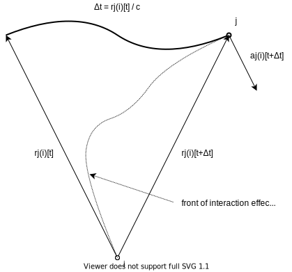
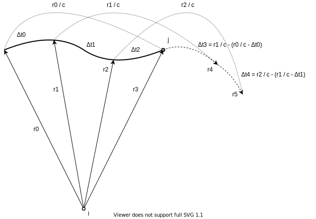

​
# Playing with a retarded interaction model of the 2-body system

An equation of motion with retarded interaction is solved numerically in an accelerating coordinate system.
The coordinate system is fixed to one of the bodies.

## The equation of motion in the accelerating frame of reference

In an inertial frame of reference, the gravitational interaction between `i` and `j` bodies:

**a**i = **v**i' = **r**ji * G * mj / rji^3

where
- **a**i is the acceleration of body `i`,
- **v**i is the velocity of body `i`,
- the apostrophe denotes the time derivative,
- **r**ji = **r**j - **r**i,
- **r**i and **r**j are the positions of the bodies `i` and `j`,
- G := 6.674 × 10^-11 m^3 kg^-1 s^-2 is the gravitational constant,
- mj is the mass of the body `j`.

Let use the

**r**(i) := **r** - **r**i

coordinate transformation for the accelerating frame of reference fixed to body `i`,

where
- **r** is an arbitrary position and **r**i is the position of body `i` in an inertial frame of reference.

Then in the accelerating frame of reference, the equation of motion of body `j` is:

**v**j(i)' = - **r**j(i) * G * (mj + mi) / rj(i)^3

where
- **v**j(i) = **v**j - **v**i is the velocity of body `j`,
- **r**j(i) = **r**ji is the position of body `j`.

## The retarded interaction

Let assume that
- body `i` feels the new position of body `j` after the interaction effect travels their distance,
- the interaction effect from body `j` travels with constant speed in the frame of reference fixed to body `i`.

So the equation of motion in the accelerating frame of reference fixed to body `i` is:

**v**j(i)'[t + Δt] = - **r**j(i)[t] * G * (mj + mi) / rj(i)[t]^3        &emsp; &emsp; [1]

where
- `t` is the classic time,
- Δt := rj(i)[t] / c is the traveling time of the interaction effect,
- `c` is the speed of the interaction effect.

## Introducing reduced quantities

The classical equation of motion of the circular movement in gravitational field:

a = v^2 / r = G / r^2       &emsp; &emsp; [2]

where
- g := G * (mi + mj),
- `a` is the acceleration,
- `v` is the velocity,
- `r` is the radius.

Let `u` be the angle of the arc which is done during the interaction effect travels the distance `r`:

u * r = v * (r / c)

Let `u` be the reduced speed:

u = v / c       &emsp; &emsp; [3]

From [2] and [3], the equation of motion with the reduced speed:

u^2 = g / r / c^2       &emsp; &emsp; [4]

So, the angle will be less when the radius gets greater.

Let `d` (and `r%`) be the reduced distance:

d := r * c^2 / g        &emsp; &emsp; [5]

Then from [4] and [5], the equation of motion of the circular movement:

u^2 = 1 / d

From the reduced quantities [3] and [5] comes the reduced time:

t% := t * c^3 / g       &emsp; &emsp; [6]

and the reduced acceleration:

a% := a * g / c^4       &emsp; &emsp; [7]

The general equation of motion in gravity with the reduced quantities:

**a**% = - **d** / d^3

Note that the interaction effect travels the distance `d` during `d` time.

## Discretizing the trajectory

Because of the retarded interaction [1], some previous position and time data are needed to calculate the next data.
The position **r**[n] will be effective after Δt = r[n] / c time in the acceleration calculation
when the position will be **r**[n + m]:

**a**[n + m] = **A**(**r**[n])

where
- **A**(**r**) = - **r** * g / r^3.

The acceleration and time difference in reduced quantities are:

**a**%[n + m] = - **r**%[n] / r%[n]^3

Δt% = r%[n]

If the first initial position is **r**[0],
then all the positions and time differences in the first **r**[0] / c time period must be known
to be able to calculate the continuation of the trajectory.

Since the time difference depends on the distance, the Verlet integration with non-constant time differences is applied:

**r**[n + 1] = **r**[n] + (**r**[n] - **r**[n - 1]) * (Δt[n] / Δt[n-1]) + **a**[n] * Δt[n] * (Δt[n] + Δt[n-1]) / 2

where
- t[n + 1] = t[n] + Δt[n],
- **a**[n] is the acceleration in position **r**[n].

### The reduced time difference is the previous reduced distance

The initial data:

{**r**[0], **r**[1]}

The time difference and acceleration for the Verlet integration:

Δt[n] = r[n] / c

**a**[n] = **A**(**r**[n - 1])

### The reduced time difference is the fraction of the effective reduced distance

The initial data:

{**r**[0], ..., **r**[k]}

{Δt[0], ..., Δt[k - 1]}

where
- k > 1,
- sum(Δt[0], ..., Δt[k - 1]) = r[0] / c.

The time difference and acceleration for the Verlet integration:

Δt[n] = r[n - k + 1] / c - (r[n - k] / c - Δt[n - k])

**a**[n] = **A**(**r**[n - k])

---

# Examples

## Sun-Mercury system

The astronomical data were obtained from the
[Sun fact sheet](https://nssdc.gsfc.nasa.gov/planetary/factsheet/sunfact.html)
and
[Mercury fact sheet](https://nssdc.gsfc.nasa.gov/planetary/factsheet/mercuryfact.html)
of NASA.
The calculation is started from the aphelion position (**r**[0]).
For the reduced time difference, the previous reduced distance is used.
The **r**[1] next initial position is calculated assuming parabolic trajectory with **A**(**r**[0]) acceleration.

With the retarded interaction, the planet drifts outwards from the Sun.
Assuming that the speed of the interaction effect is the speed of light in vacuum,
the orbit changes the following way after many orbital period:

The characteristics of the calculation:
| orbital period | iteration | iteration per orbit |
|---------------:|----------:|--------------------:|
|              1 |     39368 |               39368 |
|            300 |  13668188 |               51782 |
|            600 |  31098958 |               64411 |
|            900 |  52345658 |               77221 |
